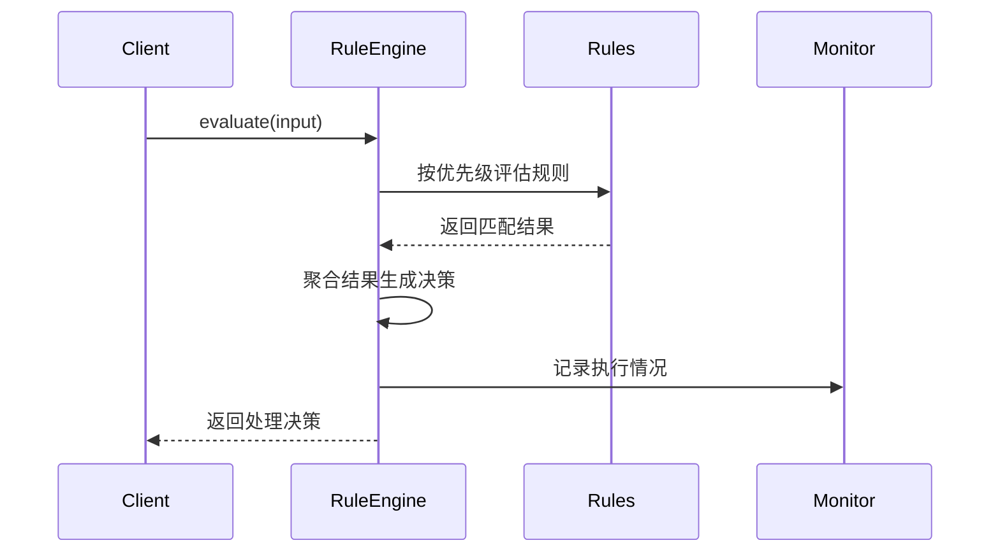

# Rule Engine 模块

该模块提供了一个灵活可扩展的规则引擎系统，用于根据预定义的规则评估输入并决定处理方式。

## 核心架构

### 主要组件
1. **IRuleEngine** - 规则引擎主接口
2. **IRule** - 规则定义接口
3. **IRuleManager** - 规则管理接口
4. **IRuleMonitor** - 规则监控接口

### 数据流
1. 输入接收 → 2. 规则评估 → 3. 决策生成 → 4. 处理执行 → 5. 结果记录

## 核心接口

### IRuleEngine
```kotlin
interface IRuleEngine {
    suspend fun evaluate(input: RuleInput): ProcessingDecision
    fun addRule(rule: IRule)
    fun removeRule(ruleId: String)
    fun updateRulePriority(ruleId: String, priority: Int)
    fun getRules(): List<IRule>
}
```

### IRule
```kotlin
interface IRule {
    val id: String
    val priority: Int
    val description: String
    suspend fun evaluate(input: RuleInput): RuleResult
}
```

## 关键数据结构

### RuleInput
```kotlin
data class RuleInput(
    val text: String,
    val type: InputType, // TEXT, VOICE, COMMAND, SYSTEM
    val metadata: Map<String, Any>?,
    val context: ProcessingContext?
)
```

### ProcessingDecision
```kotlin
data class ProcessingDecision(
    val processor: ProcessorType, // LOCAL_EMBEDDING, LLM_API, HYBRID
    val confidence: Float,
    val matchedRules: List<IRule>,
    val parameters: ProcessingParameters
)
```

## 规则管理

### IRuleManager
```kotlin
interface IRuleManager {
    suspend fun loadRules(source: RuleSource) // File, Remote, Database
    suspend fun saveRules(rules: List<IRule>)
    fun validateRule(rule: IRule): ValidationResult
}
```

## 监控系统

### IRuleMonitor
```kotlin
interface IRuleMonitor {
    fun recordRuleExecution(rule: IRule, input: RuleInput, result: RuleResult)
    fun getRuleStatistics(ruleId: String): RuleStatistics
    fun observeRuleExecutions(): Flow<RuleExecution>
}
```

## 规则示例

### 简单文本匹配规则
```kotlin
class TextMatchRule(
    override val id: String = "text-match-rule",
    override val priority: Int = 100,
    override val description: String = "匹配特定关键词的规则",
    private val keywords: Set<String>
) : IRule {
    override suspend fun evaluate(input: RuleInput): RuleResult {
        val match = keywords.any { input.text.contains(it) }
        return RuleResult(
            matches = match,
            confidence = if (match) 0.9f else 0.1f,
            suggestedProcessor = ProcessorType.LOCAL_EMBEDDING
        )
    }
}
```

### 复杂上下文规则
```kotlin
class ContextAwareRule : IRule {
    override suspend fun evaluate(input: RuleInput): RuleResult {
        val context = input.context ?: return noMatch()
        
        // 检查用户历史交互
        val recentInteractions = context.previousInteractions.takeLast(3)
        val hasSimilarQuestions = recentInteractions.any { 
            it.input.similarity(input.text) > 0.7 
        }
        
        return if (hasSimilarQuestions) {
            RuleResult(
                matches = true,
                confidence = 0.85f,
                suggestedProcessor = ProcessorType.LLM_API,
                metadata = mapOf("cacheKey" to "similar_question_response")
            )
        } else {
            noMatch()
        }
    }
}
```

## 性能优化

1. **规则优先级** - 高优先级规则先评估
2. **短路评估** - 当匹配置信度足够高时可提前终止评估
3. **并行评估** - 独立规则可并行评估
4. **结果缓存** - 缓存常见输入的评估结果

## 扩展点

1. **自定义规则类型** - 实现IRule接口
2. **自定义规则源** - 扩展RuleSource
3. **自定义监控** - 实现IRuleMonitor
4. **自定义验证** - 扩展ValidationResult

## 典型工作流



## 最佳实践

1. 保持规则简单单一职责
2. 使用合理的优先级设置
3. 为规则添加清晰的描述
4. 实现全面的监控
5. 定期审查和优化规则集
