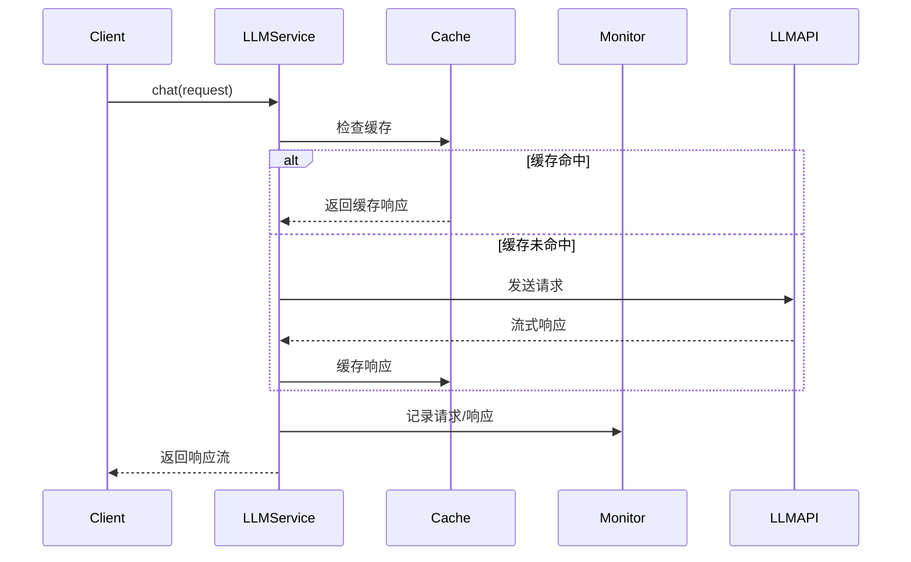

# LLM 模块

该模块提供了与大语言模型(LLM)交互的完整服务系统，支持对话、补全和嵌入功能，并包含配置管理、监控和缓存等辅助功能。

## 核心架构

### 主要组件
1. **ILLMService** - 主服务接口
2. **ILLMConfig** - 配置管理接口
3. **ILLMMonitor** - 监控接口
4. **ILLMCache** - 缓存接口

### 数据流
1. 请求准备 → 2. 请求发送 → 3. 流式响应处理 → 4. 结果缓存 → 5. 监控记录

## 核心接口

### ILLMService
```kotlin
interface ILLMService {
    // 对话式交互
    fun chat(request: LLMRequest): Flow<LLMResponse>
    
    // 文本补全
    fun complete(request: LLMRequest): Flow<LLMResponse>
    
    // 文本嵌入
    suspend fun embed(text: String): List<Float>
    
    // 请求取消
    fun cancelRequest()
}
```

## 关键数据结构

### LLMRequest
```kotlin
data class LLMRequest(
    val messages: List<LLMMessage>, // 消息历史
    val parameters: LLMParameters, // 生成参数
    val options: LLMOptions? = null // 请求选项
)
```

### LLMMessage
```kotlin
data class LLMMessage(
    val role: MessageRole, // 消息角色
    val content: String,   // 消息内容
    val metadata: Map<String, Any>? = null // 元数据
)
```

## 配置管理

### ILLMConfig
```kotlin
interface ILLMConfig {
    fun getApiKey(): String
    fun getModelConfig(): ModelConfig
    fun getApiConfig(): ApiConfig
    fun updateConfig(config: Map<String, Any>)
}
```

### ModelConfig
```kotlin
data class ModelConfig(
    val modelName: String,
    val modelVersion: String,
    val contextLength: Int, // 上下文长度
    val maxTokens: Int,     // 最大token数
    val supportedFeatures: Set<ModelFeature> // 支持的功能
)
```

## 监控系统

### ILLMMonitor
```kotlin
interface ILLMMonitor {
    fun recordRequest(request: LLMRequest, startTime: Long)
    fun recordResponse(response: LLMResponse, endTime: Long)
    fun getUsageStatistics(): LLMUsageStatistics
}
```

### LLMUsageStatistics
```kotlin
data class LLMUsageStatistics(
    val totalRequests: Int,      // 总请求数
    val totalTokens: Int,        // 总token数
    val averageResponseTime: Long, // 平均响应时间
    val errorRate: Float,        // 错误率
    val costEstimate: Float      // 成本估算
)
```

## 缓存系统

### ILLMCache
```kotlin
interface ILLMCache {
    suspend fun getCachedResponse(request: LLMRequest): LLMResponse?
    suspend fun cacheResponse(request: LLMRequest, response: LLMResponse)
    suspend fun clearCache()
}
```

## 使用示例

### 基础对话
```kotlin
val llmService: ILLMService = // 获取服务实例

val request = LLMRequest(
    messages = listOf(
        LLMMessage(MessageRole.SYSTEM, "你是一个有帮助的助手"),
        LLMMessage(MessageRole.USER, "你好！")
    ),
    parameters = LLMParameters(
        temperature = 0.7f,
        maxTokens = 100
    )
)

llmService.chat(request).collect { response ->
    when (response) {
        is LLMResponse.Content -> println(response.text)
        is LLMResponse.Error -> println("错误: ${response.error}")
        LLMResponse.Done -> println("完成")
    }
}
```

### 嵌入生成
```kotlin
val embedding = llmService.embed("这是一个示例文本")
println("嵌入向量维度: ${embedding.size}")
```

## 实现建议

1. **多模型支持**:
   - 实现适配器模式支持不同LLM API
   - 支持本地模型和远程API

2. **性能优化**:
   - 实现请求批处理
   - 支持并发请求
   - 实现智能缓存策略

3. **错误处理**:
   - 实现自动重试机制
   - 支持降级处理
   - 详细的错误分类

4. **扩展功能**:
   - 支持函数调用
   - 支持多模态输入
   - 支持自定义插件

## 典型工作流



## 最佳实践

1. **消息构建**:
   - 保持清晰的对话历史
   - 合理使用系统提示
   - 添加有用的元数据

2. **参数调优**:
   - 根据场景调整temperature
   - 设置合理的maxTokens
   - 使用stop序列控制生成

3. **错误处理**:
   - 处理各种错误类型
   - 实现优雅降级
   - 提供用户友好的错误信息

4. **性能监控**:
   - 监控响应时间
   - 跟踪token使用
   - 估算API成本
