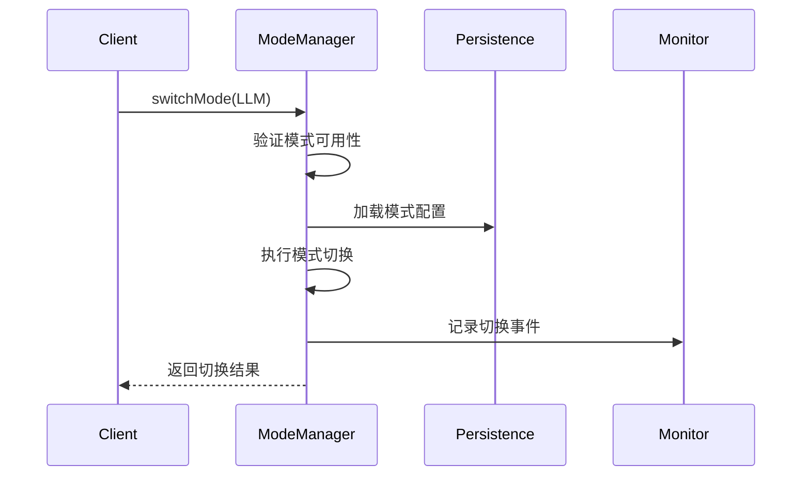

# Mode 模块

该模块提供了系统处理模式的管理功能，支持多种处理模式的动态切换、状态监控和配置管理。

## 核心架构

### 主要组件
1. **IModeManager** - 模式管理主接口
2. **IModePersistence** - 模式持久化接口
3. **IModeMonitor** - 模式监控接口
4. **IModeSwitchListener** - 模式切换监听接口

### 数据流
1. 模式切换请求 → 2. 状态验证 → 3. 配置加载 → 4. 模式切换 → 5. 状态更新 → 6. 结果通知

## 核心接口

### IModeManager
```kotlin
interface IModeManager {
    // 切换处理模式
    suspend fun switchMode(mode: ProcessingMode)
    
    // 获取当前模式
    fun getCurrentMode(): ProcessingMode
    
    // 观察模式变化
    fun observeMode(): Flow<ProcessingMode>
    
    // 检查模式可用性
    suspend fun isModeAvailable(mode: ProcessingMode): Boolean
    
    // 获取模式配置
    fun getModeConfig(mode: ProcessingMode): ModeConfig
}
```

## 处理模式类型

### ProcessingMode
```kotlin
enum class ProcessingMode {
    LOCAL,      // 本地处理模式
    LLM,        // LLM API处理模式
    HYBRID,     // 混合处理模式
    AUTO        // 自动选择模式
}
```

## 模式配置

### ModeConfig
```kotlin
data class ModeConfig(
    val mode: ProcessingMode,        // 模式类型
    val parameters: Map<String, Any>, // 模式参数
    val restrictions: ModeRestrictions, // 模式限制
    val features: Set<ModeFeature>   // 支持的功能
)
```

### ModeRestrictions
```kotlin
data class ModeRestrictions(
    val maxInputLength: Int,         // 最大输入长度
    val maxConcurrentRequests: Int,  // 最大并发请求数
    val requestsPerMinute: Int,      // 每分钟请求限制
    val requiresNetwork: Boolean     // 是否需要网络
)
```

## 模式状态

### ModeState
```kotlin
data class ModeState(
    val currentMode: ProcessingMode, // 当前模式
    val isAvailable: Boolean,       // 是否可用
    val status: ModeStatus,         // 状态
    val error: String? = null       // 错误信息
)
```

### ModeStatus
```kotlin
enum class ModeStatus {
    ACTIVE,     // 活跃状态
    INACTIVE,   // 非活跃状态
    SWITCHING,  // 切换中状态
    ERROR       // 错误状态
}
```

## 持久化接口

### IModePersistence
```kotlin
interface IModePersistence {
    // 保存模式设置
    suspend fun saveMode(mode: ProcessingMode, config: ModeConfig)
    
    // 加载模式设置
    suspend fun loadMode(): Pair<ProcessingMode, ModeConfig>?
    
    // 清除保存的模式设置
    suspend fun clearMode()
}
```

## 监控系统

### IModeMonitor
```kotlin
interface IModeMonitor {
    // 记录模式切换
    fun recordModeSwitch(
        fromMode: ProcessingMode,
        toMode: ProcessingMode,
        duration: Long
    )
    
    // 记录模式使用情况
    fun recordModeUsage(mode: ProcessingMode, metrics: ModeMetrics)
    
    // 获取模式统计信息
    fun getModeStatistics(mode: ProcessingMode): ModeStatistics
}
```

## 使用示例

### 基本模式切换
```kotlin
val modeManager: IModeManager = // 获取服务实例

// 切换到LLM模式
modeManager.switchMode(ProcessingMode.LLM)

// 获取当前模式
val currentMode = modeManager.getCurrentMode()
println("当前模式: $currentMode")

// 观察模式变化
modeManager.observeMode().collect { mode ->
    println("模式已更改为: $mode")
}
```

### 检查模式可用性
```kotlin
val isAvailable = modeManager.isModeAvailable(ProcessingMode.HYBRID)
if (isAvailable) {
    println("混合模式可用")
} else {
    println("混合模式不可用")
}
```

## 实现建议

1. **模式切换**:
   - 实现平滑过渡
   - 处理资源初始化
   - 确保线程安全

2. **状态管理**:
   - 实现状态验证
   - 处理并发请求
   - 提供详细错误信息

3. **性能优化**:
   - 缓存模式配置
   - 预加载资源
   - 异步状态检查

4. **扩展功能**:
   - 支持自定义模式
   - 添加模式依赖检查
   - 实现模式回退机制

## 典型工作流



## 最佳实践

1. **模式设计**:
   - 保持模式职责单一
   - 明确定义模式边界
   - 提供清晰的模式文档

2. **状态处理**:
   - 实现全面的状态监控
   - 提供详细的错误信息
   - 实现优雅降级

3. **性能监控**:
   - 监控模式切换时间
   - 跟踪模式使用情况
   - 记录资源使用情况

4. **用户体验**:
   - 提供模式切换反馈
   - 显示模式状态变化
   - 处理模式限制情况
