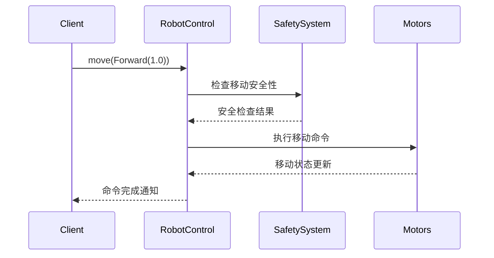

# Robot 模块

该模块提供了完整的机器人控制功能，包括移动控制、状态监控、安全管理和配置管理。

## 核心架构

### 主要组件
1. **IRobotControl** - 机器人控制主接口
2. **IRobotConfig** - 机器人配置接口
3. **IRobotControlListener** - 控制监听接口

### 控制流程
1. 命令接收 → 2. 安全检查 → 3. 命令执行 → 4. 状态更新 → 5. 结果反馈

## 核心接口

### IRobotControl
```kotlin
interface IRobotControl {
    // 移动控制
    suspend fun move(movement: MovementCommand)
    
    // 停止移动
    suspend fun stop()
    
    // 转向控制
    suspend fun rotate(rotation: RotationCommand)
    
    // 速度控制
    suspend fun setSpeed(speed: SpeedCommand)
    
    // 获取当前状态
    fun getRobotState(): RobotState
    
    // 观察状态变化
    fun observeState(): Flow<RobotState>
    
    // 执行自定义命令
    suspend fun executeCommand(command: RobotCommand)
}
```

## 命令系统

### MovementCommand
```kotlin
sealed class MovementCommand {
    data class Forward(val distance: Float? = null) : MovementCommand()
    data class Backward(val distance: Float? = null) : MovementCommand()
    data class Left(val distance: Float? = null) : MovementCommand()
    data class Right(val distance: Float? = null) : MovementCommand()
    data class Custom(val x: Float, val y: Float) : MovementCommand()
}
```

### RotationCommand
```kotlin
sealed class RotationCommand {
    data class Angle(val degrees: Float) : RotationCommand()
    data class Direction(val direction: RotationDirection) : RotationCommand()
    data class Custom(val x: Float, val y: Float, val z: Float) : RotationCommand()
}
```

### SpeedCommand
```kotlin
data class SpeedCommand(
    val linear: Float,    // 线速度 (-1.0 到 1.0)
    val angular: Float    // 角速度 (-1.0 到 1.0)
)
```

## 状态监控

### RobotState
```kotlin
data class RobotState(
    val position: Position,      // 当前位置
    val orientation: Orientation, // 当前方向
    val speed: Speed,            // 当前速度
    val batteryLevel: Float,     // 电池电量
    val status: RobotStatus,     // 状态
    val error: RobotError?       // 错误信息
)
```

### Position
```kotlin
data class Position(
    val x: Float,
    val y: Float,
    val z: Float
)
```

### Orientation
```kotlin
data class Orientation(
    val roll: Float,
    val pitch: Float,
    val yaw: Float
)
```

## 安全系统

### IRobotConfig
```kotlin
interface IRobotConfig {
    // 获取最大速度
    fun getMaxSpeed(): Speed
    
    // 获取加速度限制
    fun getAccelerationLimits(): AccelerationLimits
    
    // 获取安全参数
    fun getSafetyParameters(): SafetyParameters
}
```

### SafetyParameters
```kotlin
data class SafetyParameters(
    val minObstacleDistance: Float,    // 最小障碍物距离
    val emergencyStopDistance: Float,  // 紧急停止距离
    val maxOperatingTime: Long,        // 最大运行时间
    val safetyChecks: Set<SafetyCheck>  // 安全检查项
)
```

## 使用示例

### 基本移动控制
```kotlin
val robotControl: IRobotControl = // 获取控制实例

// 向前移动1米
robotControl.move(MovementCommand.Forward(1.0f))

// 向右转90度
robotControl.rotate(RotationCommand.Angle(90f))

// 设置速度
robotControl.setSpeed(SpeedCommand(linear = 0.5f, angular = 0.2f))

// 停止移动
robotControl.stop()
```

### 状态监控
```kotlin
// 获取当前状态
val state = robotControl.getRobotState()
println("当前电池电量: ${state.batteryLevel}%")

// 观察状态变化
robotControl.observeState().collect { newState ->
    println("位置更新: x=${newState.position.x}, y=${newState.position.y}")
}
```

## 实现建议

1. **控制实现**:
   - 实现平滑加速/减速
   - 处理命令队列
   - 支持命令中断

2. **安全系统**:
   - 实现实时安全检查
   - 紧急停止机制
   - 故障恢复流程

3. **状态管理**:
   - 精确的位置跟踪
   - 实时状态更新
   - 详细的错误报告

4. **扩展功能**:
   - 支持自定义命令
   - 添加轨迹记录
   - 实现自动避障

## 典型工作流



## 最佳实践

1. **控制设计**:
   - 保持命令简单明确
   - 提供足够的控制粒度
   - 支持组合命令

2. **安全考虑**:
   - 实现多重安全保护
   - 定期自检
   - 清晰的错误报告

3. **性能优化**:
   - 高效的命令处理
   - 最小化状态更新延迟
   - 优化资源使用

4. **用户体验**:
   - 提供实时反馈
   - 清晰的错误处理
   - 详细的文档说明
