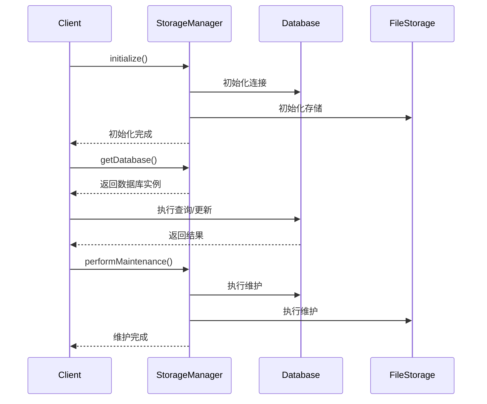

# Storage 模块

该模块提供了统一的存储管理系统，整合了数据库存储和文件存储功能，并包含配置管理、监控和维护等辅助功能。

## 核心架构

### 主要组件
1. **IStorageManager** - 存储管理主接口
2. **IDatabase** - 数据库存储接口
3. **IFileStorage** - 文件存储接口
4. **IStorageConfig** - 存储配置接口
5. **IStorageMonitor** - 存储监控接口
6. **IStorageRecovery** - 存储恢复接口

### 数据流
1. 存储初始化 → 2. 请求处理 → 3. 数据存储/检索 → 4. 状态监控 → 5. 定期维护

## 核心接口

### IStorageManager
```kotlin
interface IStorageManager {
    // 初始化存储系统
    suspend fun initialize()
    
    // 关闭存储系统
    suspend fun shutdown()
    
    // 获取数据库实例
    fun getDatabase(): IDatabase
    
    // 获取文件存储实例
    fun getFileStorage(): IFileStorage
    
    // 执行存储维护
    suspend fun performMaintenance()
    
    // 获取存储状态
    fun getStorageStatus(): StorageStatus
    
    // 观察存储事件
    fun observeStorageEvents(): Flow<StorageEvent>
}
```

## 存储状态

### StorageStatus
```kotlin
data class StorageStatus(
    val databaseStatus: DatabaseStatus,    // 数据库状态
    val fileSystemStatus: FileSystemStatus, // 文件系统状态
    val totalStorageUsage: StorageUsage,   // 总存储使用情况
    val lastMaintenance: Instant           // 最后维护时间
)
```

### DatabaseStatus
```kotlin
data class DatabaseStatus(
    val isConnected: Boolean,  // 连接状态
    val version: Int,          // 版本
    val tableCount: Int,       // 表数量
    val totalRecords: Long,    // 总记录数
    val storageUsage: StorageUsage, // 存储使用
    val performance: PerformanceMetrics // 性能指标
)
```

## 配置管理

### IStorageConfig
```kotlin
interface IStorageConfig {
    // 获取数据库配置
    fun getDatabaseConfig(): DatabaseConfig
    
    // 获取文件系统配置
    fun getFileSystemConfig(): FileSystemConfig
    
    // 获取维护配置
    fun getMaintenanceConfig(): MaintenanceConfig
}
```

### DatabaseConfig
```kotlin
data class DatabaseConfig(
    val connectionString: String, // 连接字符串
    val maxConnections: Int,      // 最大连接数
    val timeout: Long,            // 超时时间
    val retryPolicy: RetryPolicy  // 重试策略
)
```

## 监控系统

### IStorageMonitor
```kotlin
interface IStorageMonitor {
    // 开始监控
    fun startMonitoring()
    
    // 停止监控
    fun stopMonitoring()
    
    // 获取监控指标
    fun getMetrics(): StorageMetrics
    
    // 观察性能指标
    fun observePerformance(): Flow<PerformanceMetrics>
}
```

## 恢复系统

### IStorageRecovery
```kotlin
interface IStorageRecovery {
    // 检查存储完整性
    suspend fun checkIntegrity(): IntegrityResult
    
    // 执行恢复操作
    suspend fun performRecovery(strategy: RecoveryStrategy)
    
    // 验证恢复结果
    suspend fun validateRecovery(): ValidationResult
}
```

## 使用示例

### 基本存储操作
```kotlin
val storageManager: IStorageManager = // 获取存储管理器

// 初始化存储
storageManager.initialize()

// 获取数据库实例
val database = storageManager.getDatabase()

// 获取文件存储实例
val fileStorage = storageManager.getFileStorage()

// 获取存储状态
val status = storageManager.getStorageStatus()
println("数据库状态: ${status.databaseStatus.isConnected}")

// 观察存储事件
storageManager.observeStorageEvents().collect { event ->
    when (event) {
        is StorageEvent.DatabaseEvent -> println("数据库事件: ${event.type}")
        is StorageEvent.FileSystemEvent -> println("文件系统事件: ${event.type}")
        is StorageEvent.ErrorEvent -> println("错误事件: ${event.error}")
    }
}
```

## 实现建议

1. **存储实现**:
   - 支持多种数据库后端(SQLite, Room, Realm等)
   - 实现文件加密存储
   - 支持大文件分块存储

2. **性能优化**:
   - 实现读写缓存
   - 批量操作支持
   - 异步IO处理

3. **安全考虑**:
   - 数据加密
   - 访问控制
   - 完整性校验

4. **扩展功能**:
   - 支持云存储同步
   - 实现数据迁移工具
   - 添加数据压缩功能

## 典型工作流



## 最佳实践

1. **存储设计**:
   - 合理规划数据存储位置(数据库 vs 文件)
   - 设计高效的数据结构
   - 考虑数据增长需求

2. **性能监控**:
   - 监控关键性能指标
   - 设置性能阈值
   - 定期优化存储

3. **错误处理**:
   - 实现全面的错误恢复
   - 提供详细的错误信息
   - 记录错误日志

4. **维护策略**:
   - 定期执行维护
   - 自动化维护任务
   - 验证维护结果
