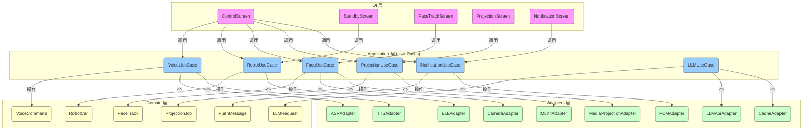

已思考若干秒


下面用 **Mermaid** 图结合文字说明，展示系统的分层结构、各层功能及输入输出，以及功能模块之间的关系。你可以把它直接粘贴到支持 Mermaid 的 Markdown 编辑器中查看渲染效果。



---

### 各层职责与输入/输出

| 层级                | 职责描述                                                                              | 输入                             | 输出                               |
| ----------------- | --------------------------------------------------------------------------------- | ------------------------------ | -------------------------------- |
| **UI 层**          | 页面渲染、用户交互、导航                                                                      | 用户点击/语音唤醒/推送消息                 | 调用对应 Use Case 接口                 |
| **Application 层** | 用例驱动（Use Case/Service），协调各领域实体执行业务流程                                              | 接口调用（如 `VoiceUseCase.start()`） | 更新 Domain 对象、调用 Outbound Port 接口 |
| **Domain 层**      | 核心业务模型（实体、值对象、领域服务），无外部依赖                                                         | Use Case 传入的参数                 | 领域状态变更、返回业务结果                    |
| **Adapters 层**    | 技术实现（BLE、ASR、TTS、Camera、ML Kit、MediaProjection、FCM、LLM API、缓存等），实现 Outbound Ports | Use Case 按需调用                  | 外部系统响应、数据存储/读取                   |

---

上述图与表格展示了：

1. **分层结构**：UI→Application→Domain→Adapters
2. **各层功能**：从页面交互到业务流程再到核心模型及技术细节
3. **输入/输出**：层与层之间的调用关系及数据流向
4. **功能模块关系**：六大业务模块（语音、机器人、面部、投影、消息、大模型）如何通过 Use Case 与适配器衔接

此图既能指导前端/后端的并行开发，也能清晰定义接口契约，保证高内聚、低耦合。希望对系统设计与开发落地有帮助！


根据您提供的 PRD 文档内容，结合六边形架构（Hexagonal Architecture）与领域驱动设计（DDD）原则，以下是该 App 的整体架构设计与完整模块划分文档，采用 Markdown 格式，便于开发团队理解、拆分与独立开发。

---

# 📱 Looi Robot 企业演示 App 系统架构设计文档

## 🧭 架构风格概览

* **整体架构**：六边形架构（Hexagonal Architecture）
* **开发原则**：模块化、可插拔、高内聚、低耦合、接口驱动开发
* **技术栈**：Jetpack Compose、CameraX、BLE、MediaProjection、ML Kit、Firebase、gRPC/REST

---

## 🧩 功能模块划分与接口定义

### 1. `robot_control` 模块（机器人控制）

* **功能**：

  * 管理 BLE 配对、连接、自动重连
  * 控制小车移动（前进、后退、转向、停止）
* **输入接口**：

  ```kotlin
  interface RobotCommander {
      fun sendMoveCommand(direction: MoveDirection)
      fun stop()
  }
  ```
* **输出接口（驱动外部 BLE）**：

  ```kotlin
  interface BLEClient {
      fun connect(mac: String): Boolean
      fun sendData(data: ByteArray): Boolean
  }
  ```

---

### 2. `voice_interaction` 模块（语音交互）

* **功能**：

  * 唤醒词检测
  * 语音识别（本地+云端）
  * 意图解析与指令派发
  * TTS 与动画反馈
* **输入接口**：

  ```kotlin
  interface VoiceInteractionService {
      fun startListening()
      fun stopListening()
      fun handleRecognizedCommand(command: String)
  }
  ```
* **输出接口**：

  ```kotlin
  interface ASRProvider
  interface TTSProvider
  interface AnimationTrigger
  ```

---

### 3. `face_recognition` 模块（人脸识别）

* **功能**：

  * 摄像头采集
  * 实时人脸检测与边框跟踪
  * 丢失检测与恢复
* **输入接口**：

  ```kotlin
  interface FaceTrackingService {
      fun start()
      fun stop()
      val facePosition: Flow<FaceBox?>
  }
  ```
* **输出接口**：

  ```kotlin
  interface CameraProvider
  interface FaceDetector
  ```

---

### 4. `projection` 模块（投影功能）

* **功能**：

  * 支持 Miracast、HDMI、AirPlay
  * 播放 PPT、PDF、视频
  * 管理投影状态（准备、投影中、停止）
* **输入接口**：

  ```kotlin
  interface ProjectionManager {
      fun listAvailableContent(): List<ContentItem>
      fun startProjection(contentId: String)
      fun stopProjection()
  }
  ```
* **输出接口**：

  ```kotlin
  interface DisplayEngine
  interface DocumentParser
  ```

---

### 5. `notification` 模块（推送消息）

* **功能**：

  * 接收 FCM 消息
  * 主题订阅管理
  * 前后台展示
* **输入接口**：

  ```kotlin
  interface NotificationService {
      fun onMessageReceived(msg: PushMessage)
      fun subscribeTopic(topic: String)
  }
  ```
* **适配器**：

  * Firebase Messaging Service

---

### 6. `llm` 模块（大语言模型）

* **功能**：

  * 与 OpenAI/阿里/百度大模型通信
  * 超时重试、缓存结果
  * 支持降级机制
* **输入接口**：

  ```kotlin
  interface LLMClient {
      suspend fun ask(prompt: String): String
  }
  ```
* **输出接口**：

  ```kotlin
  interface LLMApiProvider
  interface LLMCache
  ```

---

### 7. `ui` 模块（前端展示与交互）

* **功能**：

  * Compose 构建页面：待机、控制、投影、人脸跟踪等
  * 动画反馈、语音波形展示
  * 页面之间导航（Navigation）
* **依赖模块**：

  * `voice_interaction`, `robot_control`, `projection`, `face_recognition`, `notification`

---

### 8. `app-core` 模块（通用接口与模型）

* 定义跨模块共享模型、接口、事件：

  ```kotlin
  data class MoveDirection(val angle: Float)
  data class PushMessage(val id: String, val content: String)
  interface UseCase<in Input, out Output>
  ```

---

## 🔁 模块依赖关系图

```text
                ┌────────────┐
                │    UI      │
                └────┬───────┘
                     │
     ┌───────────────┼─────────────────────┐
     │               │                     │
┌────▼────┐    ┌─────▼─────┐         ┌─────▼─────┐
│voice-   │    │robot-     │         │projection │
│interaction│  │control     │         │           │
└────┬────┘    └────┬──────┘         └─────┬─────┘
     │              │                         │
     ▼              ▼                         ▼
┌────────┐     ┌────────────┐          ┌────────────┐
│ face-  │     │ notification│          │llm-integration│
│tracking│     └────────────┘          └────────────┘
└────────┘
```

---

## ⚙️ 技术与开发建议

| 层级     | 技术栈                             | 建议            |
| ------ | ------------------------------- | ------------- |
| UI     | Jetpack Compose + Navigation    | 分屏模块化开发       |
| BLE 控制 | Android BluetoothGatt API       | 提供模拟器与日志      |
| 语音识别   | SpeechRecognizer + 云端 SDK       | ASR 网络降级处理    |
| 投影     | MediaProjection + HDMI/Miracast | HDMI 支持 USB-C |
| 推送     | Firebase Cloud Messaging        | 支持 Topic 管理   |
| LLM    | Retrofit + gRPC + 本地缓存层         | 插件式配置         |

---

## ✅ 模块化开发优势

| 特性   | 体现                           |
| ---- | ---------------------------- |
| 高内聚  | 各模块独立封装各自业务逻辑                |
| 低耦合  | 模块间通过接口通信（Port 接口），无实现依赖     |
| 可测试性 | Domain 与 UseCase 可脱离 UI 独立单测 |
| 易扩展  | 替换或新增适配器不影响核心业务层             |
| 并行开发 | 多个团队成员可基于接口并行开发              |

---

如需，我还可以为各模块导出 **UML 类图**、**接口定义文档（IDL）** 或 **JSON Schema** 文件用于接口对接和自动生成文档。是否需要？
